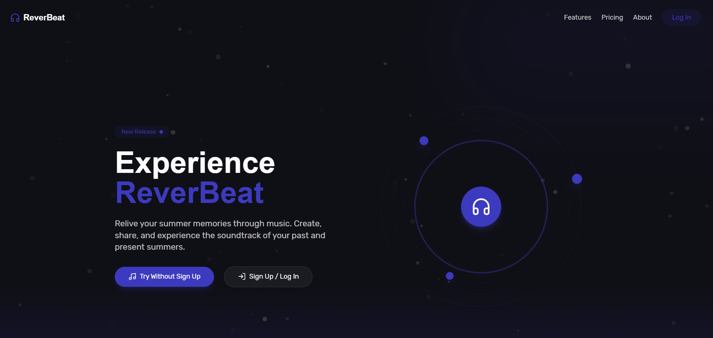

# 🎵 Summer Memories – AI-Powered SaaS Music Player

**An AI-enhanced, modern SaaS Music Platform built for Gen Z and casual listeners to relive summer memories, discover music by mood, and share nostalgia.**



## 🌟 Overview

**Summer Memories** is a futuristic, responsive, Progressive Web App (PWA) music platform that captures the emotional aspect of music and memories. Users can upload songs, explore AI-recommended playlists, record summer memories, and create personalized musical journeys — all within a smooth, engaging UI built using the latest frontend tech.

> 🚀 Built with MERN stack, GSAP for animations, Tailwind CSS for styling, and powered by Cloudinary, AI, and modern design principles.

---

## 🔮 Features

### 🎧 Core Music Experience
- **Upload Music & Cover Images**
- **Tag-based Organization** (mood, genre, moment)
- **AI-Based Smart Playlist Generator**
- **Favorites and Library Management**
- **Offline Support** with **PWA Capabilities**

### 🧠 AI Capabilities
- **Mood-based Playlist Generation**
- **Smart Recommendations** based on user behavior and tags
- **AI-Suggested Memory Entries**
- **Playlist Builder with Emotion Tags**

### 🎞️ Nostalgia + Memories
- **Summer Journey Timeline**: Chronicle your summer memories with music entries
- **Mood History & Entry Log**
- **Photos + Audio Journal Entries**

### 🌍 Social & Sharing
- **Collaborative Playlist Sharing**
- **Social Media Sharing (Instagram Stories, X/Twitter, etc.)**
- **No Sign-up Access for Exploration**
- **Modern Auth Flows with GSAP Transitions**

### 💻 Tech Stack
| Tech         | Description                            |
|--------------|----------------------------------------|
| **MERN**     | MongoDB, Express.js, React.js, Node.js |
| **Tailwind** | Utility-first CSS framework            |
| **GSAP**     | High-performance animations            |
| **Cloudinary** | Media storage for songs + images     |
| **PWA**      | Offline support & mobile-ready         |

---

## 📦 Installation

```bash
# Clone repo
git clone https://github.com/mk070

# Install frontend
cd client
npm install

# Install backend
cd ../server
npm install

# Start backend
cd server
npm run dev

# Start frontend
cd client
npm run dev

Server (.env):
PORT=5000
MONGO_URI=your_mongodb_uri
CLOUDINARY_CLOUD_NAME=your_cloud_name
CLOUDINARY_API_KEY=your_key
CLOUDINARY_API_SECRET=your_secret
JWT_SECRET=super_secret_key

Client (.env):
VITE_BACKEND_URL=http://localhost:5000
